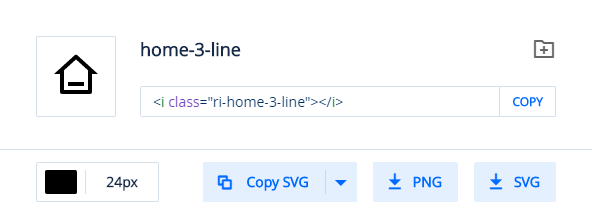

<h1 align="center">Angular Remix Icon</h1>
<p align="center">
  <a href="https://github.com/adisreyaj/angular-remix-icon/blob/master/LICENSE.md">
    
  </a>
    
  <a href="https://twitter.com/AdiSreyaj">
    
  </a>
</p>

> Use Remix Icons in your angular application


Wrapper for using remix icons in your angular application.
All the icons are injected as svgs and you can apply color and sizes to them with ease.

### Demo

https://admiring-noether-0b971e.netlify.app/

### Usage

_1. Install the package_

```sh
npm install angular-remix-icon
```

_2. Import the module to `App Module`_

```ts
import { AngularRemixIconModule } from "angular-remix-icon";
```

_3. Import Required Icons_

For the library to work, the required icons needs to be configured first

```ts
...
import {
  RiAncientGateFill,
  RiHome2Fill,
  AngularRemixIconModule,
} from 'angular-remix-icon';

// Configure the required icons before hand
const icons = {
  RiAncientGateFill,
  RiHome2Fill,
};

@NgModule({
  imports: [
    BrowserModule,
    AngularRemixIconModule.configure(icons),
  ],
  ...
})
export class AppModule {}
```

You can get the name from the [Remix Icon](https://remixicon.com) website



The required icons can be imported as see above. For eg: If you need the `home-3-line`, You have to import the corresponding Icon:

```ts
import { RiHome3Line } from "angular-remix-icon";
```

_4. Use in template_

You can now start using the icons like so:

```html
<rmx-icon name="home-3-line"></rmx-icon>
```

### Styling

If you want change color or size of the icons,

```html
<rmx-icon name="home-3-line" style="color:blue"></rmx-icon>
```

or

```css
.blue-icon {
  color: blue;
}
.large-icon {
  width: 30px;
  height: 30px;
}
```

```html
<rmx-icon name="home-3-line" class="blue-icon large-icon"></rmx-icon>
```

## 🤝 Contributing

Contributions, issues and feature requests are welcome.<br />
Feel free to check [issues page](https://github.com/adisreyaj/angular-remix-icon/issues) if you want to contribute.

## Author

👤 **Adithya Sreyaj**

- Twitter: [@AdiSreyaj](https://twitter.com/AdiSreyaj)
- Github: [@adisreyaj](https://github.com/adisreyaj)

## 👍🏼 Show your support

Please ⭐️ this repository if this project helped you!

## 📝 License

Copyright © 2020 [Adithya Sreyaj](https://github.com/adisreyaj).<br />

This project is [Apache License 2.0](https://github.com/adisreyaj/angular-remix-icon/blob/master/LICENSE.md) licensed.
